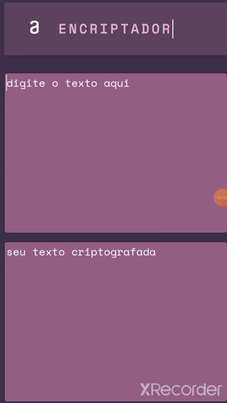

#  🔒 Codificiador 🔒
 

🟣Projeto Decodificador Alura Challenge Oracle ONE 🟣 

### :hammer_and_wrench: Linguagens Utilizadas no Projeto :

&nbsp;
&nbsp;
&nbsp;

### ✒️ Descrição 

Este é um Sistema de codificação de palavras, que utiliza se de criptografar as vogais, retornando assim uma nova palavra. Utilizando se de um sistema simples de criptografia

### 😱 Como funciona as substituição nessa criptografia :

- `Vogal a: `Transforma em : ai
- `Vogal e: `Transforma em : enter
- `Vogal i: `Transforma em : imes
- `Vogal o: `Transforma em : ober
- `Vogal u: `Transforma em : ufat
___ 
###  
:computer: Prévia do projeto:computer:

 
Abaixo está uma visualização estática do projeto

  

<a href="Https://github.com/Dumsol/criptografia-#readme"></a

### 
:star::star::star:
 

### 

